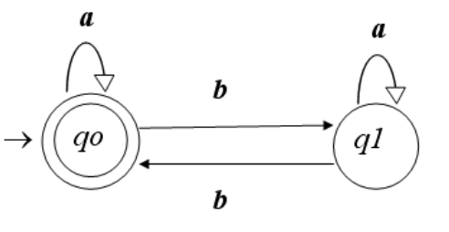

In Computer Science we get introduced to the **formal computational perspective to know what can (and what cannot) a computer do**.

For this purpose we **utilize** mathematical tools, like logic and linguistics, **formalize** the problem resolution methods and **obtain** abstract languages models, from computers and from computing processes.

# History

- Maths and logic, in the 30's, Gödel, Turing, Church... Stablishes the fundamental boundries of computational calculus.
- Engineering, in the 30's and 50's, Shanonn. Formalization of sequential circuits of finite state machines.
- Linguistics, in the 50's, Chomsky. Formal specification of languages and its grammar and hierarchy.


## Graphs

Defined as a schema with nodes `{V}` and edges `R⊂V×V`.

- Arc: oriented edge `(vi, vj)`
- Loop: edge with a single node `(vi, vj)`
- Precedent (of a node `v`): is another `vi` which `(vi,v)∈R` 
- Next (of a node `v`): is another `vi` which `(v, vi)∈R`

**Useful to represent state machine and automata**

# Finite automata

- Deterministic finite automata (DFA)
- Non-deterministic finite automata (NFA)
- Finite automata with empty transitions (NFA-ε)

## Automata

Is a mathematical model that can be applied to:

- Electromechanical machines
- Digital circuits
- Processes and sequencial systems
- Decision algorithms
- Lexical analysis
- Search
- Commmunication protocols
- ...

We're going to focus our attention on DFAs, which has a formal representation of `A = (∑, Q, f, qo, F)`.
It is a quintuple formed by:
- `∑` = Input alphabet.
- `Q` = Set of (finite and not empty) states.
- `f` = Transition function `f : Q × ∑ → Q`.
- `f(state, symbol)=state` <- _only one!_
- `q0 ∈ Q` = Initial state.
- `F ⊆ Q` = Set of final states.

They are represented in tables or graphs.
- Example: `Ej. A=( {a, b} , {q0, q1} , f , qo, {qo} )`

**Table**

| f     | a  | b  |
|-------|----|----|
| ->*q0 | q0 | q1 |
| q1    | q1 | q0 |

**Graph**



### Automata and words

Given a function `f`, it can be expanded to a chain of symbols such as:
- `f : Q × ∑*→Q`
- `f (q, ε) = q`
- `f (q, aw) = f ( f(q, a), w)`

#### DFA's associated language

Chains which are used by the automata to reach from `f0` to a final state.
- `L(A) = {w∈∑* / f(q0, w)∈F}`

## Regular languages

Any set of chains (above a closed alphabet) which can be represented by:
- An automata
- A regular expression
- A regular grammar

So: `{L(AF)} = {L(ER)} = {L(G3)}`

We're going to skip what is a regular expression because it scapes from the article's scope, nevertheless we can deduce that **`automata ≡ regular expression`**.
Why? 
- Analysis theorem of Kleene
- Synthesis theorem of Kleene

# Turing's machine

In a short description it is a transformation between an input and an ouput. Mental's process model (algorithmic).

## Formal definition

**`M = ( ∑, Γ, #, Q, q0, f, F)`**

- `∑` Machine's alphabet
- `Γ` Record's alphabet
- `# ∈ Γ` White space (empty section) that `#∉∑`
- `Q` Finite set of states
- `q0∈Q` Initial state
- `f` Transition partial function.
    - `f: Q × Γ → Q × Γ × {R, L}`
- `F⊆Q` Set of final or stop states.

**The behavior is deterministic**

# Turing's machine in applied software development.

We aim to apply a known Turing's machine definition to a computer program, using the Swift language for this purpose.


_Why is this relevant to software development?_
- We can create a finite number of states and transitions between them so we can expect a Turing's machine, so we can assume that our application's behavior is **deterministic**.

## Mini

During my work in BQ, we have developed a library which, with this ideas in mind, can be used in production applications.

During this section, we're going to explain al the elements in the architecture and how to use it.

### State

- The minimal unit of the architecture is based on the idea of the State. State is, as its name says, the representation of a part of the application in a moment of time.

- The State is a simple struct which is conformed of different Promises that holds the individual pieces of information that represents the current state, this can be implemented as follows.

- For example:

```swift
struct MyCoolState: StateType, Equatable {
    let cool: Promise<Bool>

    init(cool: Promise<Bool> = .idle()) {
        self.cool = cool
    }
}
```

- The default inner state of a `Promise` is `idle`. It means that no `Action` (see more below), has started any operation over that `Promise`. A `Promise` is the reprensentation of a potential state transition with some kind of data attached with it (or not).

- The core idea of a `State` is its [immutability](https://en.wikipedia.org/wiki/Immutable_object), so once created, no third-party objects are able to mutate it out of the control of the architecture flow.

- As can be seen in the example, a `State`  has a pair of  `Task` + `Result`  *usually* (that can be any object, if any), which is related with the execution of the `Task`. In the example above, `CoolTask` is responsible, through its `Reducer` to fulfill the `Action` with the `Task` result and furthermore, the new `State`.

### Action

- An `Action` is the piece of information that is being dispatched through the architecture. Any `class` can conform to the `Action` protocol, with the only requirement of being unique its name per application.

```swift
class RequestContactsAccess: Action {
  // As simple as this is.
}
```

- `Action`s are free of have some pieces of information attached to them, that's why **Mini** provides the user with two main utility protocols: `CompletableAction`, `EmptyAction` and `KeyedPayloadAction`.

 - A `CompletableAction` is a specialization of the `Action` protocol, which allows the user attach both a `Task` and some kind of object that gets fulfilled when the `Task` succeeds.

```swift
struct RequestContactsAccessResult: CompletableAction {

    let promise: Promise<Bool?>

    typealias Payload = Bool
}
```

- An `EmptyAction` is a specialization of `CompletableAction` where the `Payload` is a `Swift.Void`, this means it only has associated a `Promise<Void>`.

```swift
struct ActivateVoucherLoaded: EmptyAction {

    let promise: Promise<Void>
}
```

- A `KeyedPayloadAction`, adds a `Key` (which is `Hashable`) to the `CompletableAction`. This is a special case where the same `Action` produces results that can be grouped together, tipically, under a `Dictionary` (i.e., an `Action` to search contacts, and grouped by their main phone number).

```swift
struct RequestContactLoadedAction: KeyedCompletableAction {

    typealias Payload = CNContact
    typealias Key = String

    let promise: [Key: Promise<Payload?>]
}
```

### Store

- A `Store` is the hub where decissions and side-efects are made through the ingoing and outgoing `Action`s. A `Store` is a generic class to inherit from and associate a `State` for it.

- A `Store` may produce `State` changes that can be observed like any other **RxSwift**'s `Observable`. In this way a `View`, or any other object of your choice, can receive new `State`s produced by a certain `Store`.

- A `Store` reduces the flow of a certain amount of `Action`s through the `var reducerGroup: ReducerGroup` property.

- The `Store` is implemented in a way that has two generic requirements, a `State: StateType` and a `StoreController: Disposable`. The `StoreController` is usually a class that contains the logic to perform the `Actions` that might be intercepted by the store, i.e, a group of URL requests, perform a database query, etc.

- Through generic specialization, the `reducerGroup` variable can be rewritten for each case of pair `State` and `StoreController` without the need of subclassing the `Store`.

```swift
extension Store where State == TestState, StoreController == TestStoreController {

    var reducerGroup: ReducerGroup
        ReducerGroup(
            Reducer(of: OneTestAction.self, on: self.dispatcher) { action in
                self.state = self.state.copy(testPromise: *.value(action.counter))
            }
        )
    }
}
```

- In the snippet above, we have a complete example of how a `Store` would work. We use the `ReducerGroup` to indicate how the `Store` will intercept `Action`s of type `OneTestAction` and that everytime it gets intercepted, the `Store`'s `State` gets copied (is not black magic 🧙‍, is through a set of [Sourcery](https://github.com/krzysztofzablocki/Sourcery) templates that are distributed with the package).

- When working with `Store` instances, you may retain a strong reference of its `reducerGroup`, this is done using the `subscribe()`  method, which is a `Disposable` that can be used like below:

```swift
var bag = DisposeBag()
let store = Store<TestState, TestStoreController>(TestState(), dispatcher: dispatcher, storeController: TestStoreController())
store
    .subscribe()
    .disposed(by: bag)
```

### Dispatcher

- The last piece of the architecture is the `Dispatcher`. In an application scope, there should be only one `Dispatcher` alive from which every action is being dispatched.

```swift
let action = TestAction()
dispatcher.dispatch(action, mode: .sync)
```

- With one line, we can notify every `Store` which has defined a reducer for that type of `Action`.

### Advanced usage

- **Mini** is built over a request-response unidirectional flow. This is achieved using pair of `Action`, one for making the request of a change in a certain `State`, and another `Action` to mutate the `State` over the result of the operation being made.

- This is much simplier to explain with a code example:

```swift
// We define our state in first place:
struct TestState: StateType {
    // Our state is defined over the Promise of an Integer type.
    let counter: Promise<Int>

    init(counter: Promise<Int> = .idle()) {
        self.counter = counter
    }

    public func isEqual(to other: StateType) -> Bool {
        guard let state = other as? TestState else { return false }
        guard counter == state.counter else { return false }
        return true
    }
}

// We define our actions, one of them represents the request of a change, the other one the response of that change requested.

// This is the request
class SetCounterAction: Action {

    let counter: Int

    init(counter: Int) {
        self.counter = counter
    }
}

// This is the response
class SetCounterActionLoaded: Action {
    
    let counter: Int
    
    init(counter: Int) {
        self.counter = counter
    }
}

// As you can see, both seems to be the same, same parameters, initializer, etc. But next, we define our StoreController.

// The StoreController define the side-effects that an Action might trigger.
class TestStoreController: Disposable {
    
    let dispatcher: Dispatcher
    
    init(dispatcher: Dispatcher) {
        self.dispatcher = dispatcher
    }
    
    // This function dispatches (always in a async mode) the result of the operation, just giving out the number to the dispatcher.
    func counter(_ number: Int) {
        self.dispatcher.dispatch(SetCounterActionLoaded(counter: number), mode: .async)
    }
    
    public func dispose() {
        // NO-OP
    }
}

// Last, but not least, the Store definition with the Reducers
extension Store where State == TestState, StoreController == TestStoreController {

    var reducerGroup: ReducerGroup {
        ReducerGroup(
          // We set the state with a Promise as .pending, someone has to fill the requirement later on. This represents the Request.
            Reducer(of: SetCounterAction.self, on: self.dispatcher) { action in
                guard !self.state.counter.isOnProgress else { return }
                self.state = TestState(counter: .pending())
                self.storeController.counter(action.counter)
            },
          // Next we receive the Action dispatched by the StoreController with a result, we must fulfill our Promise and notify the store for the State change. This represents the Response.
            Reducer(of: SetCounterActionLoaded.self, on: self.dispatcher) { action in
                self.state.counter
                    .fulfill(action.counter)
                    .notify(to: self)
            }
        )
    }
}
```

#### Documentation

All the documentation available can be found **[here](http://opensource.bq.com/mini-swift/docs/)**

# Recap

We have described how an _automata_ can be represented in a formal or mathematical way, but it can be used in computed development to make predictable the behavior of a computer application.

_Why is this possible?_ Because given a state `A` and we want the application to be in a state `B` we can only execute an action `X` which makes `A - X -> B` and there is no other action in the application to reach this goal.

For record, we can log every state and action change in the application and rewind all the effects to reach the initial state named `A`.

This kind of behavior makes predictable that every user interaction which produces and action and, therefore, a state change in the application is deterministic and cloned in any further environment with the same semantics.